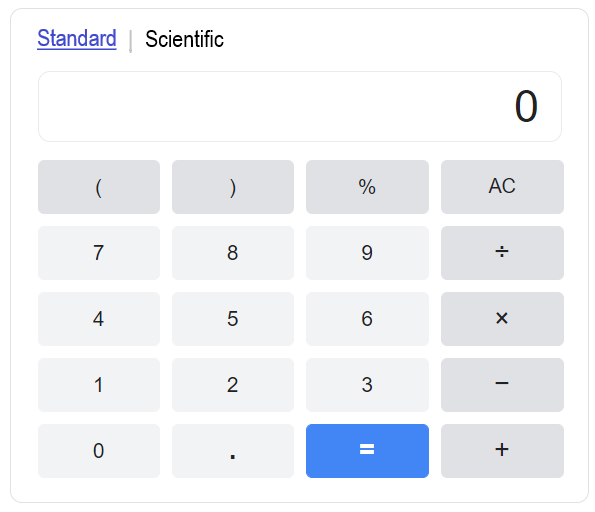

# React-Calculator-Project

### Requirements
1. A user can view the calculator in Standard mode 
2. A user can view the calculator in Scientific mode 
3. A user can toggle between the Scientific and Standard Views
4. The system should change the color of the button when the user hovers the mouse over the button

### Mock Ups

## Part 1

#### Standard View

## Part 2

#### Scientific View

